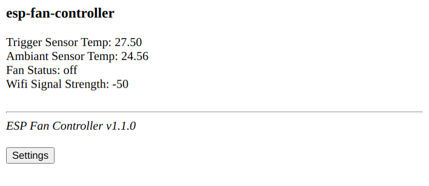
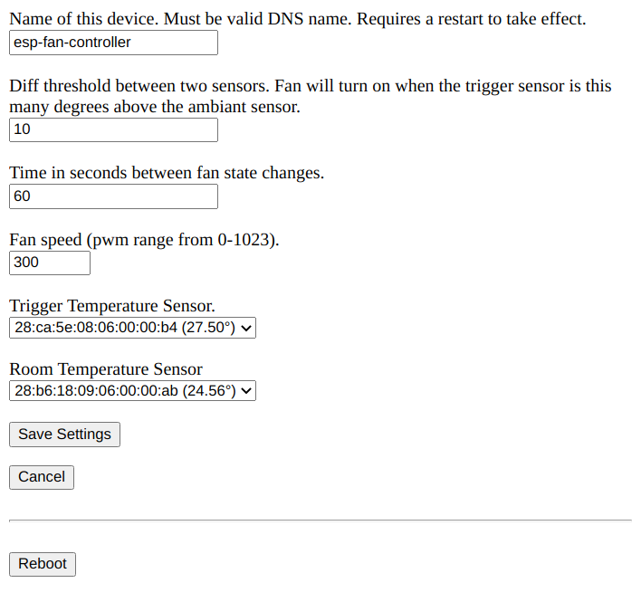
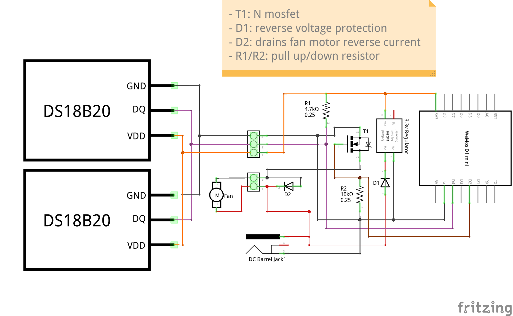

# ESP-Fan-Controller

ESP8266 based fan controller with a webui. 

This is designed for applications where the fan should turn on when one temp probe (the trigger probe) is x degrees warmer than the other (the ambiant probe). 

Example usecases:
* Turn on a radiator fan when the radiator is warmer than the room.
* Turn on an cooling fan when the outside temp is cooler than inside the house.

This project uses two ds1820 sensor. It also provides a basic web interface. 

The webui index provides the current sensor values and is updated every few seconds. The /status endpoint also provides this and more information in json.
The webui also allows you to configure all of the device settings.

## Instructions

After flashing, the device will create a wifi AP called `esp-fan-controller`. Connect to to the ap, go to http://192.168.4.1, and configure your wifi details.

Once the device is connected to your network, connect to it using a web browser on port 80 and configure the temperature sensor addresses and other settings. 

## WebUI
Main index page

Settings page

## Electronic Design

